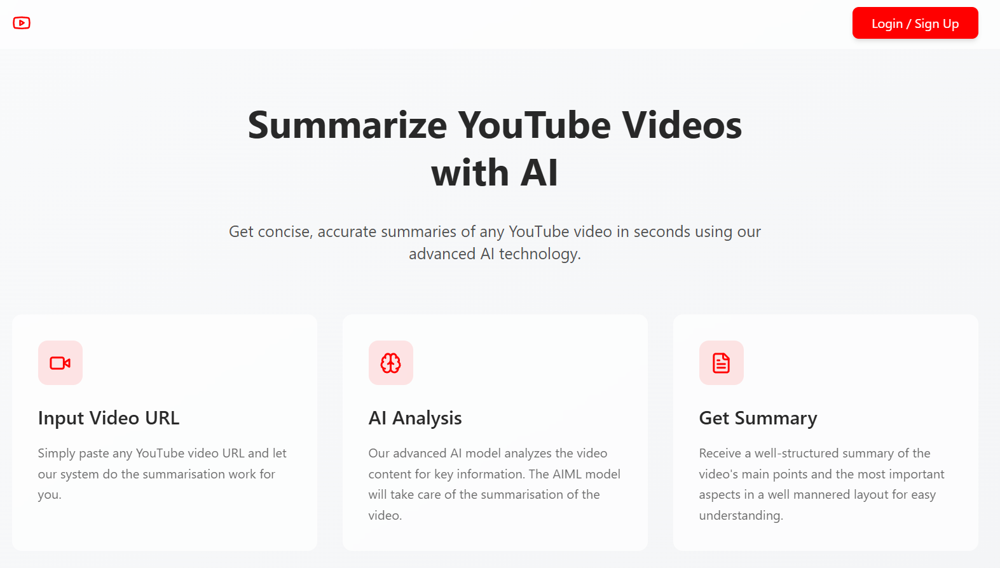

# 📺 YouTube Video Summarizer with AI

---

[](https://rudranshyoutube.netlify.app/)

Get **instant, accurate summaries** of YouTube videos using **AI-powered analysis**. Paste a YouTube URL, sign in, and receive a clear, structured summary in seconds.


---

## 🚀 Features

- 🔗 **Input YouTube URL** – Just paste any video link.
- 🧠 **AI Summarization** – Uses **Gemini via OpenRouter** for intelligent summarization.
- ⚡ **Fail-Safe Transcript Fetching** – Uses two RapidAPI endpoints with fallback handling.
- 🔐 **Secure Login** – Passwordless and password-based auth via **Nhost**.
- 🗃️ **History Tracking** – User summary history stored securely in the **Nhost database** using **Hasura permissions**.
- 🌐 **Fully Deployed on Netlify** – Fast, modern web app with global CDN.

---

## 🧰 Tech Stack

| Layer       | Tech                                                                 |
|-------------|----------------------------------------------------------------------|
| Frontend    | JavaScript, HTML, CSS, TypeScript                                    |
| Backend     | [n8n](https://n8n.io/) (for API + AI orchestration)                  |
| AI          | [Gemini](https://openrouter.ai/) via OpenRouter                      |
| Auth & DB   | [Nhost](https://nhost.io/) (Auth, PostgreSQL, Hasura Actions)        |
| Hosting     | [Netlify](https://netlify.com/)                                      |
| Transcripts | [YouTube Transcriptor](https://rapidapi.com/benrhzala90/api/youtube-transcriptor) (Fallback: [YouTube Transcript3](https://rapidapi.com/solid-api-solid-api-default/api/youtube-transcript3)) |

---

## 🧪 How It Works

1. **User Auth**: Users sign in via Nhost (magic link or password).
2. **Paste YouTube Link**: On the frontend, users input a YouTube video URL.
3. **Hasura Action**: Validated action triggers a request to your **n8n webhook**.
4. **n8n Workflow**:
   - Attempts transcript fetch from the first RapidAPI.
   - On failure, falls back to the second API.
   - Passes transcript to **Gemini (OpenRouter)** with a custom prompt.
   - Returns AI-generated summary back to Hasura.
5. **Store + Display**:
   - Summary is shown to the user.
   - History is saved in the Nhost DB with user ownership permissions.

---

## 🛠️ Setup Instructions

### 1. Clone the Repo

```
git clone https://github.com/rd9437/Youtube_Summarizer.git
cd Youtube_Summarizer
```

### 2. Install Dependencies

```npm install```

### 3. Environment Variables

```
VITE_NHOST_BACKEND_URL=https://your-nhost-instance.app
VITE_OPENROUTER_API_KEY=your-openrouter-key
VITE_N8N_WEBHOOK_URL=https://your-n8n-instance/webhook-url
```
(replace with yours)

### 4. Run the Project Locally
```
npm run dev
```

## 🌐 Deployment

The app is fully deployed on Netlify.

### Netlify Build Settings:

- Build Command: npm run build

- Publish Directory: dist or build (based on your bundler setup)

